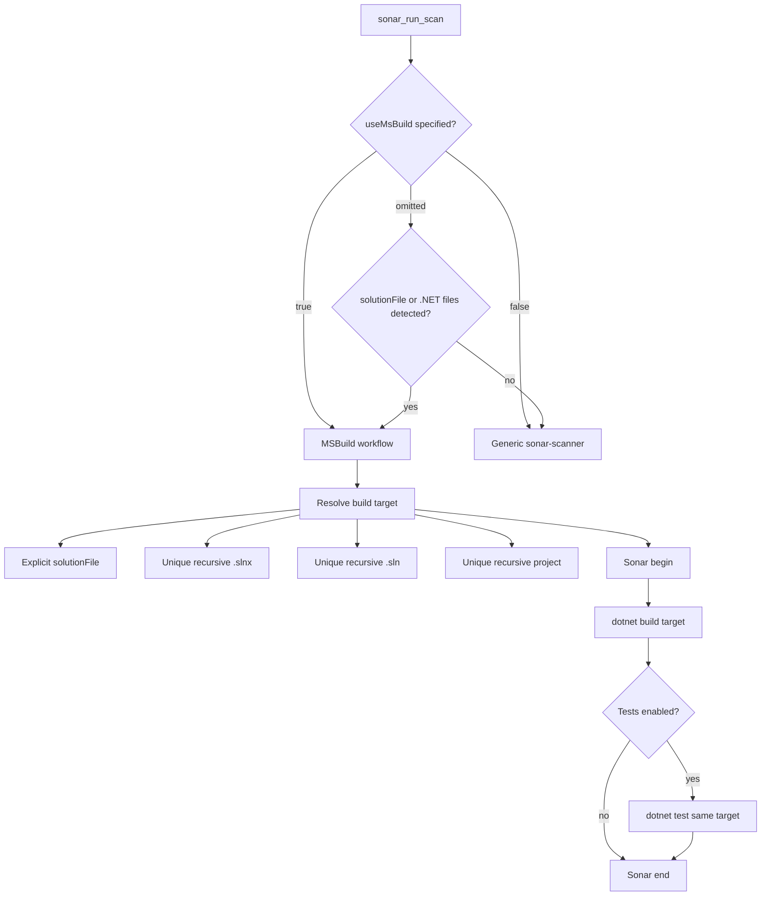

# Sonar MSBuild Scan Workflow

## MSBuild target selection

1. An explicit `solutionFile` is authoritative.
2. Otherwise, a unique recursive `.slnx` is preferred.
3. Otherwise, a unique recursive `.sln` is used.
4. Otherwise, a unique recursive `.csproj` or `.vbproj` is used.
5. The resolved build target is also passed to `dotnet test`.

There is no separate test-directory or test-solution selection. Coverage and TRX reports are collected from tests belonging to the same solution or project used for the scan.
