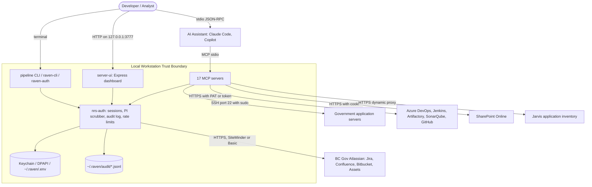
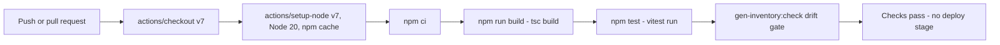

# Application Architecture & Technology Document: RAVEN - Resource Analytics, Visibility & Enterprise Navigator

This document provides a comprehensive blueprint and technology assessment of **Resource Analytics, Visibility & Enterprise Navigator (RAVEN)**. It is designed to be maintained, verified, and parsed by the Architecture Review Agent to ensure architectural standards, security policies, and technical currency are continuously verified.

---

## Revision History

| Version | Date | Author | Changes |
| :--- | :--- | :--- | :--- |
| `1.0` | `2026-09-14` | `Crow Architecture Review Agent` | `Initial generation from source evidence on branch feature/44-persistent-auth-profile at commit 08b0af3, using the codebase-memory graph (3,340 nodes / 9,466 edges, 0 skipped files).` |

> **Read this as a snapshot, not as the current state.** The assessment below
> was generated from commit `08b0af3`, before any remediation. Its security
> sections therefore describe `RSEC-001` through `RSEC-007` as open — no origin
> or host checking on the dashboard routers, unseparated identifiers missing
> from the PI scrubber, SSH host key verification disabled — and all seven are
> fixed on `security-remediation-2026-09-14`. The remediation table in
> `docs/security-review.md` is the current state. Regenerate this document with
> the Crow Architecture Review Agent once that branch merges, rather than
> editing the analysis by hand, so it stays consistent with the executive
> report generated from the same data.

> **Runtime correction (2026-09-15):** The original support conclusion was
> incorrect even at the assessment date. Node 20 in CI reached EOL on
> 2026-04-30; the Node 25 review runtime reached EOL on 2026-06-01. Node 22 is
> Maintenance LTS. See section 1 of `docs/security-review.md` for the outstanding
> runtime migration and the official release-schedule source.

---

## 1. Metadata & Organizational Alignment

| Metadata Field | Value / Description |
| :--- | :--- |
| **Application Acronym** | RAVEN |
| **Full Application Name** | Resource Analytics, Visibility & Enterprise Navigator |
| **Status** | Active — `bcgovpubcode.yml` sets `product_status: active`. Note `catalog-info.yaml` sets `lifecycle: experimental`; the two descriptors disagree and should be reconciled. |
| **Ministry** | Citizens' Services (`bcgovpubcode.yml`) |
| **Division** | Connected Services BC (`program_area`, `bcgovpubcode.yml`) |

Product owner and data custodian are both recorded as James Gagan in `bcgovpubcode.yml`. The repository is public at `bcgov/raven` (`catalog-info.yaml`, `github.com/project-slug`).

---

## 2. System Overview & Boundaries

### 2.1 Capability Statement

RAVEN is a local-first suite of Model Context Protocol (MCP) servers that lets an AI assistant on a developer workstation query BC Government enterprise systems — Jira, Confluence, Bitbucket, Azure DevOps, Jenkins, Artifactory, SonarQube, SharePoint — and read logs from government application servers over SSH. Its users are developers and analysts on the Connected Services BC Epsilon team. Its distinguishing capability is that personal information is scrubbed on the workstation before any enterprise content reaches a model, and credentials never leave protected per-user storage.

### 2.2 System Context Diagram



### 2.3 Platform role, reuse, and data responsibility

| Assessment | Result | Evidence / Owner | Confidence |
| :--- | :--- | :--- | :--- |
| **Conditional role** | Integration adapter | Every package brokers between a local assistant and an existing upstream system of record; RAVEN stores no business data of its own. Evidenced across `packages/*-mcp/src/server.ts`. | `Verified` |
| **One-to-many impact** | Multiple consumers | One instance per developer workstation, but all instances call shared multi-tenant BC Gov backends. Client-side throttling in `packages/auth/src/rate-limit.ts` exists specifically to protect those shared upstreams. | `Verified` |
| **Reuse or build decision** | Built in-house by Connected Services BC. No equivalent BC Gov MCP layer was available that satisfies SiteMinder SSO, FOIPPA scrubbing, and per-user credential isolation together. | Owner: James Gagan (`bcgovpubcode.yml` `product_owner`). No shared-service catalogue was consulted in-repo; absence of a catalogue is not evidence one does not exist. | `Inferred` |
| **Data custodian and permitted purpose/subject scope** | James Gagan; purpose limited to software engineering, application monitoring, and operational troubleshooting. Subject scope is BC Gov staff whose names appear incidentally in tickets and logs. | `bcgovpubcode.yml` `data_custodian`; scrubbing enforced by `packages/auth/src/pi-scrubber.ts`. | `Verified` |
| **Data sharing spectrum** | Closed | No outbound publication. Data flows only between the workstation and systems the operator is already entitled to use. `hosting_platforms_custom: Local developer workstation; no server deployment`. | `Verified` |
| **Narrow question API vs. broad data access** | Narrow question tools | Tools expose bounded operations with Zod-validated arguments and capped result sets rather than raw data export. | `Verified` |

For the one-to-many case, consumer support is informal: there is no published SLO, no compatibility notification channel, and no deprecation process for MCP tool contracts. A breaking tool-schema change would surface to consumers only as a runtime failure. Upstream capacity is protected by `TokenBucket` and `CircuitBreaker` in `@nrs/auth`.

---

## 3. Logical & Structural Component Breakdown

This section documents the actual project structure and highlights the real architectural boundaries (modules, packages, and code boundaries).

```
raven/
├── .github/workflows/ci.yml      # Build + test gate (GitHub Actions)
├── crow.config                   # Crow project memory: Sonar key + scan exclusions
├── bcgovpubcode.yml              # BC Gov public code registry descriptor
├── catalog-info.yaml             # Backstage component descriptor
├── docs/                         # Architecture, system design, tool inventory
├── scripts/                      # Credential setup, tool-inventory generator
└── packages/
    ├── auth/                     # SHARED CORE: sessions, PI scrubber, audit log, rate limiting
    ├── jira-mcp/                 # Issues, sprints, boards, deployment calendar
    ├── confluence-mcp/           # Pages, CQL search, markdown-to-storage conversion
    ├── bitbucket-mcp/            # Repos, PRs, diffs, code search, push/commit
    ├── assets-mcp/               # Jira Assets CMDB (read-only)
    ├── overview-mcp/             # Composite cross-system project summary
    ├── health-mcp/               # Derived sprint/velocity/portfolio metrics
    ├── bug-classifier-mcp/       # Bug clustering by shared root cause
    ├── server-mcp/               # SSH log search and monitoring (privileged)
    ├── imis-mcp/                 # Server inventory + read-only remote inspection (privileged)
    ├── ado-mcp/                  # Azure DevOps work items, repos, pipelines
    ├── sonar-mcp/                # SonarQube metrics, issues, local scan runner
    ├── jenkins-mcp/              # Jobs, builds, queue, credentials
    ├── artifactory-mcp/          # Repositories, artifacts, builds
    ├── sharepoint-mcp/           # Sites, documents, lists (read-only)
    ├── github-mcp/               # GHAS alerts, SARIF, PRs, issues
    ├── rfcbuddy-mcp/             # RFC schedule search
    ├── jarvis-mcp/               # Dynamic remote MCP proxy
    ├── server-ui/                # Express dashboard on 127.0.0.1:3777
    ├── pipeline/                 # Autonomous triage-and-PR CLI (uses Copilot SDK)
    └── raven-cli/                # Local terminal chat interface
```

### 3.1 Key Architecture Seams

Derived from the codebase-memory import graph over project `raven`. The seams are functional, not purely directory-based.

* **Cluster 1:** `Shared security kernel`
  * *Key Components:* `packages/auth/src/session-manager.ts`, `pi-scrubber.ts`, `audit-log.ts`, `rate-limit.ts`, `load-env.ts`, `http-client.ts`
  * *Purpose:* Every other package depends on this one. It owns credential loading, SiteMinder session lifecycle, personal-information scrubbing, tamper-evident audit logging, and upstream throttling. It is the single highest-consequence module in the repository: a defect here is a defect in all 20 consumers.
* **Cluster 2:** `Atlassian-family readers`
  * *Key Components:* `jira-mcp`, `confluence-mcp`, `bitbucket-mcp`, `assets-mcp`, and the composite `overview-mcp`, `health-mcp`, `bug-classifier-mcp`
  * *Purpose:* Share one authentication path and one HTTP client. The composite packages consume the primitive ones rather than re-implementing API access, which keeps the auth surface narrow.
* **Cluster 3:** `Privileged remote execution`
  * *Key Components:* `packages/server-mcp/src/ssh-client.ts`, `packages/server-mcp/src/commands/log-search.ts`, `packages/imis-mcp/src/ssh-executor.ts`
  * *Purpose:* The only cluster that executes commands on remote hosts with elevated privilege. Both packages independently implement a shell-metacharacter denylist and an SSH client, with near-duplicate logic that has already drifted apart — `imis-mcp` blocks the pipe character while `server-mcp` does not. This duplication is the principal architectural risk in the repository.
* **Cluster 4:** `Local web surface`
  * *Key Components:* `packages/server-ui/src/server.ts` and 15 routers under `packages/server-ui/src/routes/`
  * *Purpose:* The only always-listening network socket RAVEN creates. It reuses `server-mcp`'s SSH client as a library.
* **Cluster 5:** `Autonomous agents`
  * *Key Components:* `packages/pipeline/src/steps/`, `packages/raven-cli`
  * *Purpose:* The only components that send repository content to an external model and the only ones that write to Bitbucket. Model tool access is disabled explicitly.

### 3.2 Entry Points & Gateways

| Entry Point | Type | Path / Reference |
| :--- | :--- | :--- |
| 17 MCP server binaries (`raven-jira-mcp`, `raven-server-mcp`, and so on) | MCP stdio server | `packages/*-mcp/src/index.ts`, exposed via `bin` in each `package.json` |
| Server Monitor dashboard | REST API over HTTP | `packages/server-ui/src/server.ts` `createApp()`, bound to `127.0.0.1:3777` |
| Autonomous DevOps pipeline | CLI | `packages/pipeline/src/index.ts`, `bin: raven-pipeline` |
| Local chat interface | CLI | `packages/raven-cli`, `bin: raven` |
| Interactive authentication | CLI | `packages/auth/src/cli.js`, `bin: raven-auth` |
| Background metric collector | Worker | `packages/server-ui/src/lib/collector.ts`, disabled on startup by default |

---

## 4. API Surface & Contracts

### 4.1 API Versioning Strategy

RAVEN publishes no versioned public HTTP API. Two internal surfaces exist and neither is versioned.

| API Version | Status | Base Path / Header | Sunset Date |
| :--- | :--- | :--- | :--- |
| MCP tool schemas (unversioned) | Active | stdio JSON-RPC; tool names such as `search_issues`, `server_log_search` | None declared |
| Server UI internal REST (unversioned) | Active | `/api/*` on `127.0.0.1:3777` | None declared |

Neither surface carries a version identifier in a path, header, or query parameter. Because both consumers are local and ship in the same repository at the same version, this has not yet caused breakage — but it means there is no mechanism to evolve a tool contract without silently breaking a pinned client.

### 4.2 Contract Documentation

| Contract Type | Location | Auto-Generated |
| :--- | :--- | :--- |
| MCP tool inventory | `docs/TOOL_INVENTORY.md` | Yes — produced by `scripts/gen-inventory.mjs`, with `npm run gen-inventory:check` as a drift gate |
| Tool argument schemas | Zod schemas inline in each `packages/*-mcp/src/server.ts` | No — hand-written, and the authoritative contract at runtime |
| System design narrative | `docs/SYSTEM_DESIGN_AND_ARCHITECTURE.md` | No |

There is no OpenAPI, AsyncAPI, or GraphQL schema. The Server UI REST surface has no machine-readable contract at all; its shape is defined only by the router implementations.

### 4.3 Contract Testing

No consumer-driven contract testing framework is present — no Pact, no Spring Cloud Contract, no schema-diff gate. The nearest equivalent is `npm run gen-inventory:check`, which fails CI when the committed tool inventory drifts from the code. That detects tool *additions and removals* but not incompatible changes to an existing tool's argument schema. Runtime argument validation is enforced by Zod at every MCP tool boundary, so a malformed call is rejected cleanly, but a *changed* schema is not detected before release.

### 4.4 Contract ownership and dependency behavior

| Contract / Dependency | Owner | Version / compatibility policy | Timeout, cancellation, retry and idempotency | Fallback, stale-data and rollback behavior |
| :--- | :--- | :--- | :--- | :--- |
| BC Gov Atlassian REST (Jira, Confluence, Bitbucket, Assets) | Upstream BC Gov platform team (external to this repository) | Not documented in-repo; RAVEN tracks upstream changes reactively | `TokenBucket` throttling and `CircuitBreaker` in `packages/auth/src/rate-limit.ts`; per-request timeouts in the shared HTTP client | Fails closed with an explicit error; no cached fallback is served |
| Remote application servers over SSH | BC Gov infrastructure operations | No contract; depends on host configuration and the `servers.conf` descriptor | `readyTimeout: 30_000` and a command timeout defaulting to 60s in both SSH clients | Fails closed and returns stderr to the caller; no retry |
| SonarQube, Jenkins, Artifactory, Azure DevOps, GitHub, SharePoint | Respective upstream platform owners | Not documented in-repo | Client-level timeouts; `wrapSshExecWithLimits` for SSH paths | Explicit error surfaced to the assistant; no silent degradation |
| GitHub Copilot SDK (`pipeline`) | GitHub | Pinned by lockfile; the 1.x migration replaced `session.destroy()` with `client.deleteSession(id)` | `aiTimeoutMs()` clamps model calls between 60s and 600s | Pipeline aborts the run; no partial PR is opened |

Dependency failure fails closed in every observed path. No code path serves stale data or downgrades authorization on failure. The one exception worth naming is not a fallback but a default: `packages/server-ui/src/lib/collector.ts` disables TLS certificate validation unconditionally for SMTP alerting, which weakens transport assurance whether or not a failure has occurred.

---

## 5. Unicode, UTF-8 & Indigenous-Language Readiness

RAVEN handles free text originating in BC Gov ticketing and documentation systems, so Indigenous-language place names and personal names can appear in transit. RAVEN is a pass-through reader, not a system of record: it holds no database and defines no collation. The gaps below are therefore lower-consequence than they would be in a registry system, but they are unevidenced rather than verified.

| Boundary | Encoding / Unicode Type | Collation / Comparison | Round-Trip Evidence | Status |
| :--- | :--- | :--- | :--- | :--- |
| UI and HTTP input/output | UTF-8 by Node.js default; no explicit charset declaration found in `packages/server-ui` | Not applicable — no sorting of user text in the HTTP layer | None | `Unknown` |
| Application processing and validation | UTF-8 JavaScript strings; no `String.prototype.normalize` call anywhere in `packages/*/src` | `localeCompare` used for ordering in six modules including `assets-mcp/src/server.ts:917` and `jira-mcp/src/field-meta.ts:67` | None | `Gap` |
| Database, indexes, and search | Not applicable — no database | Not applicable | Not applicable | `N/A` |
| Messages, caches, and integrations | UTF-8 JSON over stdio and HTTPS; `~/.raven/audit/*.jsonl` written as UTF-8 | Not applicable | None | `Unknown` |
| Files, imports, exports, reports, and printing | `mammoth`, `pdf-parse`, `turndown`, `markdown-it` handle document extraction; encoding behavior is delegated to those libraries | Not applicable | None | `Unknown` |
| Runtime globalization data and fonts | Node.js 20/22 on a developer workstation with full ICU by default; no invariant-globalization flag set | Depends on workstation ICU | None | `Inferred` |

- **Normalization policy:** None. No Unicode normalization form is declared or applied. Text is passed through as received, so a name supplied in NFD will not compare equal to the same name in NFC.
- **Identifier vs. linguistic comparison policy:** Not distinguished. `localeCompare` is applied to identifier-like values such as ISO date strings and server names, where an ordinal comparison would be correct and locale-independent. SonarQube flags several of these as defects.
- **Grapheme-aware operations:** None. Text truncation in prompt-building paths slices by UTF-16 code unit, which can split a surrogate pair or detach a combining mark.
- **Known incompatible downstream systems and migration plan:** None identified; no assessment has been performed.
- **Representative Indigenous-language test corpus:** None present in the repository. No test exercises non-ASCII text end to end.

---

## 6. Security Architecture

This section defines the security posture, authentication/authorization model, cryptographic controls, and compliance assertions. Vulnerability findings are out of scope here and are recorded in the security review.

### 6.1 Authentication & Authorization Model

| Aspect | Implementation |
| :--- | :--- |
| **Authentication Method** | SiteMinder SSO session cookie (`SMSESSION`) captured via an interactive browser login, or HTTP Basic against the BWA host; PAT or API token for Azure DevOps, Jenkins, Artifactory, GitHub and SonarQube; SSH password or opt-in key for application servers |
| **Identity Provider** | BC Gov SiteMinder with IDIR, reached through an interactive Playwright-driven browser login (`packages/auth/src/capture-script.ts`) |
| **Authorization Model** | Delegated — RAVEN makes no authorization decision of its own. Every upstream call carries the operator's own identity, so the operator's existing entitlements are the authorization boundary |
| **Token Format** | Opaque session cookie for SiteMinder; bearer or basic credentials for the token-based providers |
| **Token Storage** | macOS Keychain or Windows DPAPI where available, otherwise `~/.raven/.env` and a session cache file written with mode 0600 |

The delegated model is a deliberate and sound choice for a local tool: it makes privilege escalation through RAVEN impossible for upstream systems, because RAVEN never holds more authority than the person running it. The model has one gap. `packages/server-ui/src/server.ts` `createApp()` mounts fifteen routers with no authentication, authorization, origin, host, or CSRF middleware, so any local process — or any web page the operator visits, via cross-origin request or DNS rebinding — can reach configuration and log endpoints with the operator's full privilege. Authorization is not enforced separately from authentication at that boundary because neither is enforced at all.

### 6.2 Cryptographic Controls

- **Secret Generation:** `crypto.randomBytes` is used for audit record identifiers in `packages/auth/src/audit-log.ts`. No use of `Math.random` for security-relevant values was found.
- **Transience of Secrets:** Credentials are loaded into memory from Keychain, DPAPI, or `~/.raven/.env` and are not written back to disk in cleartext by the auth package. One exception exists outside it: `packages/pipeline/src/steps/create-pr.ts` writes a password-bearing URL into `.git/config` for the duration of a push and removes it in a `finally` block, so abnormal termination can leave it on disk.
- **Credential Storage:** RAVEN is a client and stores no user credential database, so no password hashing applies. Upstream credentials are stored by the platform keystore, not by RAVEN.
- **Side-Channel Mitigation:** No constant-time comparison or uniform rejection delay was found. This is low-consequence here because RAVEN authenticates *to* remote services rather than validating inbound credentials — there is no attacker-controlled authentication endpoint to time.

### 6.3 Concurrency & Data Integrity

- **Lock Granularity:** RAVEN runs as independent single-purpose processes with no shared mutable server state, so global lock contention does not arise. The one cross-process lock is `packages/pipeline/src/scheduled-run-lock.ts`, which prevents two scheduled pipeline runs from overlapping.
- **Race Condition Prevention:** No multi-step privilege alteration exists in the codebase; RAVEN grants no privileges. The audit log appends under a hash chain, so concurrent writes would be detectable as a chain break rather than silently interleaving.
- **DB-Level Invariants:** Not applicable — there is no database. Uniqueness constraints do not arise.

### 6.4 Audit & Logging

- **Structured Audit Events:** `packages/auth/src/audit-log.ts` writes newline-delimited JSON records to `~/.raven/audit/*.jsonl` with `newAuditId`, `hashRecord`, and `canonicalJson`. Each record chains to its predecessor by SHA-256 from a `GENESIS_HASH`, and `verifyAuditFile` walks the chain to detect tampering. This is a stronger integrity guarantee than typical application logging.
- **PII Redaction:** `packages/auth/src/pi-scrubber.ts` `scrubText()` is applied before content is logged or sent to a model, replacing emails, separator-formatted SINs and phone numbers, prefixed IDIRs, bearer tokens and long credential values. The scrubber is regex-based and pattern coverage is incomplete — unseparated nine-digit and ten-digit values and bare IDIRs are not matched. The control is present and wired into the right paths; its pattern set is the weakness.

### 6.5 Data Classification

| Data Category | Classification | Encryption at Rest | Encryption in Transit | Retention Policy |
| :--- | :--- | :--- | :--- | :--- |
| Upstream credentials and session cookies | Restricted | Yes — Keychain or DPAPI; `~/.raven/.env` fallback is plaintext at mode 0600 | TLS 1.2+ | Session cache expires after roughly 25 minutes; `.env` persists until edited |
| Jira, Confluence and Bitbucket content (may contain incidental personal information) | Confidential | No — held in memory only | TLS 1.2+ | Not retained; discarded at process exit |
| Application server logs retrieved over SSH | Confidential | No — streamed, no local temp file | SSH transport | Not retained |
| Audit records under `~/.raven/audit` | Internal | No — plaintext JSONL at mode 0600 | Not applicable, local only | Indefinite; no rotation or purge implemented |
| Cloned Bitbucket repositories under `~/.raven/repos` | Internal | No | TLS 1.2+ during clone | Retained across pipeline runs |

---

## 7. Deployment & Infrastructure

### 7.1 Environment Topology

RAVEN has no server deployment. `bcgovpubcode.yml` states this directly: `hosting_platforms_custom: Local developer workstation; no server deployment`. The environments below describe where the *code* runs, not a hosted tier model.

| Environment | Purpose | Hosting | URL / Endpoint |
| :--- | :--- | :--- | :--- |
| **Development** | Local build and test on a workstation | Developer machine, Node.js 20 or 22 | Not applicable — stdio and `127.0.0.1:3777` |
| **Test / QA** | Automated build and unit tests per push and pull request | GitHub Actions `ubuntu-latest` runner | Not applicable — no deployed endpoint |
| **Staging** | Not applicable — no staged deployment exists | Not applicable | Not applicable |
| **Production** | The operator's own workstation is the only runtime | Developer machine | Not applicable — no shared production instance |

The systems RAVEN *reads* do have environment tiers (integration, test, delivery and production application servers), but those are external dependencies rather than RAVEN deployment targets.

### 7.2 CI/CD Pipeline



| Pipeline Aspect | Details |
| :--- | :--- |
| **CI Platform** | GitHub Actions — a single `build-and-test` job in `.github/workflows/ci.yml` |
| **Artifact Registry** | None — no package is published; `npm ci` consumes the public registry via a committed lockfile |
| **Deployment Strategy** | None — the workflow has no deploy stage; developers install from a git checkout |
| **Infrastructure-as-Code** | None — no Terraform, Bicep, Helm, or Pulumi definitions exist in the repository |

The workflow applies least privilege (`permissions: contents: read`), pins actions to major versions, and cancels superseded runs by concurrency group. It contains **no security scanning gate**: the file's own header comment records that CodeQL must be enabled separately in repository settings, and no SAST, SCA, or dependency-audit step runs in CI. A dependency advisory published after a merge is therefore not surfaced by any automated gate in this repository.

### 7.3 Container & Orchestration

| Aspect | Details |
| :--- | :--- |
| **Container Runtime** | None — no Dockerfile exists anywhere in the repository |
| **Base Image** | Not applicable — no image is built |
| **Orchestration** | None — processes are launched directly by the MCP client or the shell |
| **Service Mesh** | None — not applicable to a single-workstation process suite |

---

## 8. Observability

### 8.1 Logging

| Aspect | Details |
| :--- | :--- |
| **Framework** | Custom minimal logger at `packages/server-ui/src/lib/logger.ts`; MCP servers write diagnostics to stderr |
| **Aggregation** | None — logs remain on the workstation and are never shipped |
| **Structured Format** | Mixed — the audit log is strict JSONL; general application logging is plaintext |
| **Correlation ID** | No — no request or trace identifier is propagated across packages |

### 8.2 Metrics & Monitoring

| Aspect | Details |
| :--- | :--- |
| **Metrics Library** | None — no Prometheus, OpenTelemetry, or StatsD instrumentation exists |
| **Dashboard** | The Server UI dashboard displays metrics *about monitored government servers*, not about RAVEN itself |
| **Key SLIs** | None defined for RAVEN. The collector tracks JVM heap, connection pools, and log error rates for the remote servers it watches |

### 8.3 Distributed Tracing

| Aspect | Details |
| :--- | :--- |
| **Tracing Library** | None — no tracing instrumentation is present |
| **Propagation** | None — no trace context is created or forwarded |

Distributed tracing is of limited value in this topology: each MCP server is a short-lived local process handling one request at a time over stdio. The absence is a reasonable design outcome rather than a gap, though it does mean a slow upstream call cannot be attributed without manual instrumentation.

### 8.4 Health Checks & Alerts

| Endpoint / Check | Purpose | Alert Threshold |
| :--- | :--- | :--- |
| `GET /api/health` | Reports reachability of configured servers; always returns HTTP 200 with the real state in the response body | None — the endpoint is informational and drives no automated alert |
| `POST /api/health/collector/start` and `/stop` | Manual lifecycle control for the background collector, which is disabled at startup by default | Not applicable — operator-triggered |
| Collector alert rules | Email via SMTP and browser Server-Sent Events when a watched server breaches a rule | Operator-configured per rule via `/api/alerts` |

There is no `/ready` readiness probe and no liveness probe in the conventional sense, which is consistent with having no orchestrator. Note that `GET /api/health` always returning 200 means a naive external check would read an unhealthy system as healthy; the status must be parsed from the body.

---

## 9. Resilience & Disaster Recovery

| Aspect | Details |
| :--- | :--- |
| **RTO (Recovery Time Objective)** | Not defined. Practically bounded by the time to re-clone the repository, run `npm install && npm run build`, and re-authenticate — on the order of minutes |
| **RPO (Recovery Point Objective)** | Not defined. RAVEN is the system of record for nothing except its own audit log, so upstream data loss is not possible through RAVEN |
| **Backup Strategy** | None implemented in-repo. Source is protected by the public GitHub remote; `~/.raven/audit/*.jsonl` and `~/.raven/.env` are **not** backed up by any mechanism in this repository |
| **Backup Frequency** | Not applicable — no backup job exists |
| **Failover Mechanism** | None — a single local process per capability, restarted manually by the operator or MCP client |
| **Graceful Degradation** | `CircuitBreaker` opens after repeated upstream failure and `TokenBucket` throttles before limits are hit (`packages/auth/src/rate-limit.ts`); SSH and API failures return explicit errors rather than silently degrading; the background collector is disabled by default so a fresh start generates no unintended SSH traffic |
| **Chaos/Resilience Testing** | No — no fault-injection or chaos testing exists |

The loss scenario that actually matters is the audit log. It is the only non-reproducible artifact RAVEN creates, it is retained indefinitely, it is stored in a single plaintext file per period under `~/.raven/audit`, and nothing backs it up or rotates it. Its hash chain makes tampering detectable but does nothing to make loss recoverable.

---

## 10. Architecture Decision Records (ADRs)

No Architecture Decision Records exist in this repository. No `docs/adr/` directory, no decision-log file, and no ADR tooling were found.

| ADR ID | Title / Theme | Status | Date | Reference |
| :--- | :--- | :--- | :--- | :--- |
| None recorded | No ADR practice is established in this repository | Not applicable | Not applicable | Candidate decisions are described narratively in `docs/SYSTEM_DESIGN_AND_ARCHITECTURE.md` |

Several decisions in this codebase are consequential enough to deserve a record and are currently preserved only as source comments: the choice to disable SSH host key verification and treat the VPN tunnel as the trust boundary (`packages/imis-mcp/src/ssh-executor.ts:221-228`); the choice to keep MCP servers as separate processes rather than one multiplexed server; and the choice to run the Copilot SDK with `availableTools: []` in the pipeline. Capturing these as ADRs would make the reasoning reviewable rather than archaeological.

---

## 11. Architecture Review Agent Verification & Compliance Checklist

This section provides a checklist utilized by the Architecture Verification Agent to validate codebase alignment. Each item is annotated with its verification confidence.

A note on how to read the boxes: the validation contract requires an item to be checked if and only if its confidence is `Verified`. The checkbox therefore tracks evidence strength, not compliance. Where a control was examined and found wanting, the item is left unchecked and the shortfall is stated inline.

### Confidence Legend
- **Verified** — Confirmed by direct evidence in source code or configuration.
- **Inferred** — Deduced from directory structure, naming conventions, or partial evidence.
- **Unknown** — Could not be determined; requires manual review.
- **N/A** — Not applicable to this application's architecture.

### Checklist

- [ ] **Technical Currency:** Node.js engine `>=20.16.0 <21 || >=22.3.0` permits EOL releases. CI uses Node 20 and the review host used Node 25; migrate both to a supported release. TypeScript 7.0.2, Express 5.2.1 and MCP SDK 1.30.0 were recorded at the assessed commit. See the runtime correction above.
- [ ] **Unicode End-to-End:** No normalization policy, no non-ASCII test, and no Indigenous-language corpus; round-trip behavior is unevidenced in either direction. `[Confidence: Unknown]`
- [ ] **Globalization Runtime:** Node.js ships full ICU by default and no invariant-globalization flag is set, but there are no production hosts or images to assert this about. `[Confidence: Inferred]`
- [x] **No Hardcoded Credentials:** SonarQube TextAndSecrets sensor over 339 files plus manual review found no live secret; all 34 high hotspots are test fixtures and example files. `[Confidence: Verified]`
- [x] **Cryptographic Controls:** `crypto.randomBytes` for identifiers, SHA-256 hash chaining for audit integrity, platform keystore for credentials; no weak algorithm in a security context. `[Confidence: Verified]`
- [ ] **Side-Channel Defenses:** Not applicable — RAVEN exposes no inbound authentication endpoint and validates no credential presented to it, so there is no rejection path an attacker could time. No constant-time comparison exists, and none is required by this architecture. `[Confidence: N/A]`
- [x] **Audit Logging:** Structured JSONL with SHA-256 chaining from a genesis hash and a `verifyAuditFile` integrity walk, covering tool invocations and state changes. `[Confidence: Verified]`
- [ ] **Concurrency Safety:** Independent single-purpose processes with no shared mutable state and one cross-process pipeline lock; no transactional boundary needed, but this is reasoned from structure rather than tested. `[Confidence: Inferred]`
- [ ] **Dependency Health:** `npm audit` reports 5 advisories including 3 high, one of them in the direct dependency `nodemailer`; license compliance was not audited in this review. `[Confidence: Unknown]`
- [ ] **Observability:** A health endpoint, a custom logger, and operator-configured email and SSE alerting exist; there are no metrics, no tracing, no correlation IDs, and no log aggregation. `[Confidence: Inferred]`
- [ ] **Deployment Pipeline:** CI runs a real build, the full vitest suite, and an inventory drift gate, but contains no SAST, SCA, or dependency-audit step — the workflow header defers CodeQL to repository settings. `[Confidence: Inferred]`
- [ ] **Data Classification:** Categories and handling are documented in section 6.5 from code evidence, but no formal classification register or retention policy exists for the audit log. `[Confidence: Inferred]`
- [ ] **Disaster Recovery:** No backup job, failover mechanism, RTO, or RPO was found anywhere in the repository; the audit log is the single non-reproducible artifact and is unprotected against loss. Recorded as inferred because this rests on absence of evidence in a repository search, not on a positive statement that no procedure exists outside the repo. `[Confidence: Inferred]`
- [x] **Platform Role (conditional):** Classified as an integration adapter with multiple-consumer impact, evidenced by the per-package broker pattern and the client-side throttling that exists to protect shared upstreams. `[Confidence: Verified]`
- [x] **Platform Data Responsibility (conditional):** Custodian and purpose recorded in `bcgovpubcode.yml`, closed sharing spectrum, narrow question tools with Zod-bounded arguments and capped result sets. `[Confidence: Verified]`
- [ ] **Contract Ownership (conditional):** External contracts are owned upstream and undocumented in-repo; RAVEN's own MCP tool schemas have no version, deprecation policy, or consumer migration path. `[Confidence: Unknown]`
- [x] **Dependency Degradation (conditional):** Timeouts on SSH and model calls, `TokenBucket` throttling, `CircuitBreaker` on repeated failure, explicit fail-closed errors, and no stale-data fallback. `[Confidence: Verified]`
- [x] **Protected Resources and Access Paths (conditional):** Enumerated in sections 2.2 and 6 — Atlassian APIs, SSH to government servers with sudo, token-based DevOps platforms, SharePoint, and the local dashboard socket. `[Confidence: Verified]`
- [ ] **Resource Authorization (conditional):** Upstream calls carry the operator's identity so entitlement is enforced at the provider, but `server-ui` enforces neither authentication nor authorization on any of its fifteen routers. `[Confidence: Inferred]`
- [ ] **Least Privilege and Lifetime (conditional):** SiteMinder sessions expire in roughly 25 minutes and sudo targets are allowlisted to named service accounts, but the unauthenticated dashboard exposes those privileges without attribution. `[Confidence: Inferred]`
- [ ] **Revocation and Exceptions (conditional):** Session expiry and `clearCachedSession` exist; there is no documented rotation schedule, no revocation path for provider tokens, and no time-bound exception process. `[Confidence: Inferred]`
- [x] **Safe Degradation and Evidence (conditional):** Every observed failure path denies rather than downgrades, no fallback weakens authorization or identity assurance, and scrubbed hash-chained audit records preserve decision evidence. `[Confidence: Verified]`
